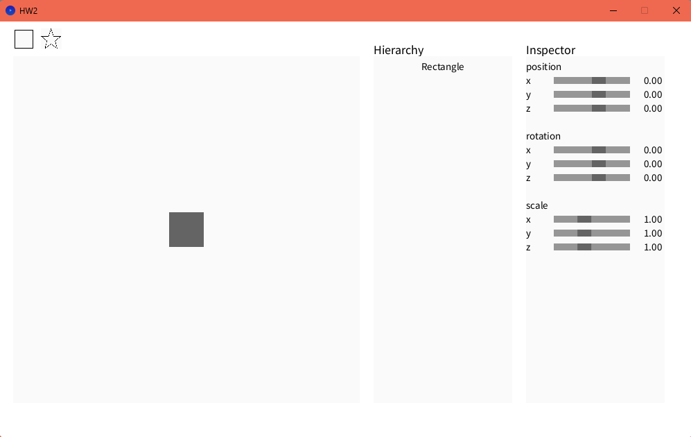
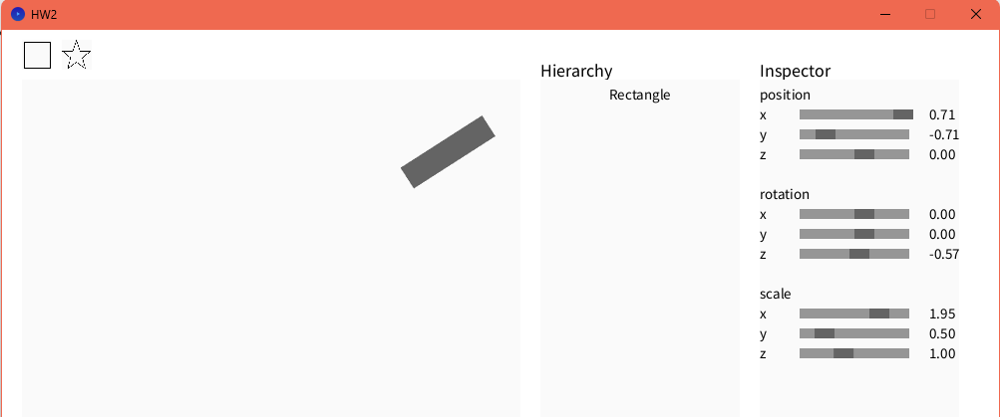
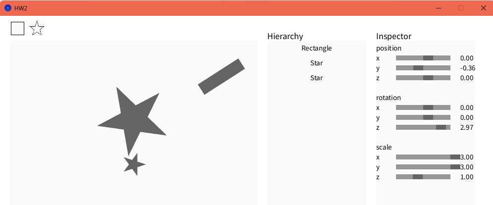

# 電腦圖學作業二報告

## 一、完成的任務

- **正確實現 3 個變換矩陣**：完成了平移（Translation）、旋轉 Z（Rotation Z）和縮放（Scaling）的 4x4 同質變換矩陣，並確保了矩陣運算的正確性。
  初始：

  

  經歷平移、旋轉、縮放：
  
- **正確實現 pnpoly**：實現了點在多邊形內的射線投射算法（Ray Casting Algorithm），利用 Jordan 曲線定理來判斷點是否在多邊形內部。
- **正確實現邊界框**：完成了軸對齊邊界框（Axis-Aligned Bounding Box, AABB）的計算，為碰撞檢測和裁剪提供了基礎。
- **正確實現 Sutherland-Hodgman 算法**：實現了凸多邊形裁剪算法，能夠將多邊形裁剪到指定的邊界內。
- **成功實現 SSAA**：完成了超級採樣抗鋸齒（Supersampling Anti-Aliasing），通過 2x2 子像素採樣有效減少了鋸齒效果。

  星星放大後不會有邊緣鋸齒效果：

## 二、如何完成這些任務

### 變換矩陣實現

在 `Matrix4.pde` 中實現了 4x4 同質變換矩陣。關鍵方法包括：

- `Trans(float x, float y, float z)`：創建平移矩陣。
- `RotZ(float theta)`：創建 Z 軸旋轉矩陣，使用餘弦和正弦函數。
- `Scale(float x, float y, float z)`：創建縮放矩陣。
- `mult(Matrix4 other)`：實現矩陣相乘，使用列主序（Column-major）存儲。
- `MulPoint(Vector3 p)`：將點與矩陣相乘，應用變換。

在實現過程中，發現矩陣相乘的順序至關重要，必須使用正確的列主序乘法來確保變換正確應用。

### pnpoly 算法實現

在 `util.pde` 中實現了 `pnpoly` 函數：

```java
boolean pnpoly(float[] verts, float px, float py) {
  boolean inside = false;
  int n = verts.length / 2;
  for (int i = 0, j = n - 1; i < n; j = i++) {
    float xi = verts[i*2], yi = verts[i*2+1];
    float xj = verts[j*2], yj = verts[j*2+1];
    if (((yi > py) != (yj > py)) && (px < (xj - xi) * (py - yi) / (yj - yi) + xi)) {
      inside = !inside;
    }
  }
  return inside;
}
```

該算法通過檢查點與多邊形邊的交點數量來判斷點是否在內部，實現簡潔高效。

### 邊界框實現

在 `util.pde` 中實現了 `findBoundBox` 函數：

```java
float[] findBoundBox(float[] verts) {
  float minX = Float.MAX_VALUE, maxX = Float.MIN_VALUE;
  float minY = Float.MAX_VALUE, maxY = Float.MIN_VALUE;
  for (int i = 0; i < verts.length; i += 2) {
    minX = min(minX, verts[i]);
    maxX = max(maxX, verts[i]);
    minY = min(minY, verts[i+1]);
    maxY = max(maxY, verts[i+1]);
  }
  return new float[]{minX, minY, maxX, maxY};
}
```

該函數通過計算多邊形的最小和最大 x、y 坐標來確定邊界框，為後續的裁剪和碰撞檢測提供了基礎。

### Sutherland-Hodgman 算法實現

在 `util.pde` 中實現了 `Sutherland_Hodgman_algorithm` 函數：
該算法通過依次對每條裁剪邊進行裁剪，將凸多邊形裁剪到指定的邊界內。關鍵是 `clipToLine` 函數，它處理點與裁剪線的交點計算和內外點的判斷。

### SSAA 實現

在 `util.pde` 中實現了 SSAA 填充邏輯：

```java
void fillShapeSSAA(float[] verts, int col) {
  float[] bbox = findBoundBox(verts);
  for (int y = (int)bbox[1]; y <= bbox[3]; y++) {
    for (int x = (int)bbox[0]; x <= bbox[2]; x++) {
      int count = 0;
      for (int sy = 0; sy < 2; sy++) {
        for (int sx = 0; sx < 2; sx++) {
          if (pnpoly(verts, x + sx * 0.5f, y + sy * 0.5f)) count++;
        }
      }
      if (count > 0) {
        float alpha = count / 4.0f;
        // 應用顏色與 alpha
      }
    }
  }
}
```

該方法使用 2x2 子像素網格，計算每個像素內有多少子像素在多邊形內，然後根據覆蓋率應用顏色，實現了平滑的抗鋸齒效果。

### 其他發現

- 為了解決旋轉樞軸問題，實現了每頂點變換：先計算形狀質心，然後對每個頂點減去質心、應用縮放和旋轉、再加回質心，最後加上位置偏移。
- 為了提高性能，將幀率降低到 10 FPS，並簡化渲染邏輯。

## 三、利用 LLM 協助完成作業

在完成這次作業的過程中，我充分利用了 GitHub Copilot 作為輔助工具，幫助我更高效地完成了以下幾個方面的工作：

- **算法實現的靈感**：在實現 pnpoly 和 Sutherland-Hodgman 算法時，Copilot 提供了參考代碼和數學公式，幫助我快速理解並完成實現。
- **代碼調試與優化**：當遇到 NullPointerException 或矩陣運算錯誤時，Copilot 提供了修復建議，例如添加 `loadPixels()/updatePixels()` 和修正列主序矩陣乘法。
- **性能改進**：在解決滑塊交互卡頓問題時，Copilot 建議降低幀率並實現 SSAA，這些建議對性能提升非常有幫助。
- **UI 改進**：在從文本字段切換到滑塊的過程中，Copilot 提供了實現範例，並幫助我添加了範圍驗證功能。
- **文檔撰寫**：在撰寫這份報告時，Copilot 幫助我梳理了結構，並提供了部分內容的初稿。
