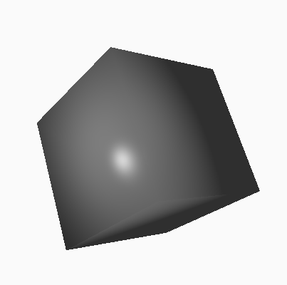
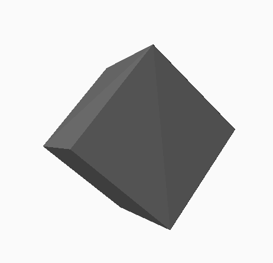
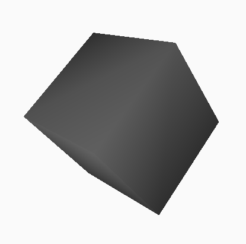
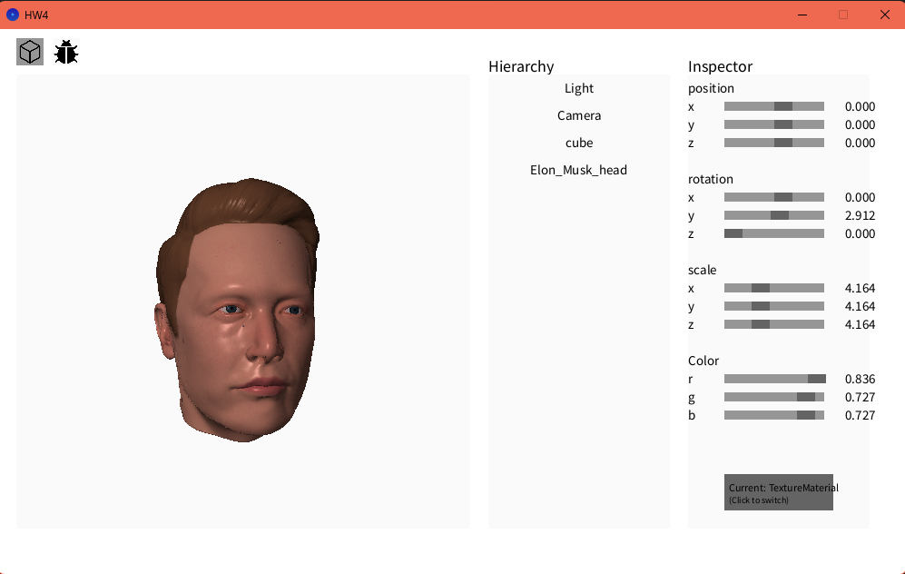

# HW4 - 進階著色與多光源系統

## 完成項目

### 基礎

- ✅ **Barycentric Coordinates**：正確實現透視校正插值
- ✅ **Phong Shading**：每像素光照，具備高光效果
- ✅ **Flat Shading**：每三角形均勻光照，呈現多面感
- ✅ **Gouraud Shading**：每頂點光照，顏色平滑插值

三種 Shading 的差異：

- **Flat Shading**
  - 光照只在每個三角形計算一次，所有像素顏色都相同。
  - 優點：速度快、輪廓明顯，適合強調多面感或 low-poly 風格。
  - 缺點：表面不平滑，高光和陰影邊界明顯。
- **Gouraud Shading**
  - 光照在每個頂點計算，三角形內部顏色用插值方式平滑過渡。
  - 優點：比 Flat Shading 平滑，效能佳，適合即時渲染。
  - 缺點：高光只在頂點出現，細節容易被忽略，表面有時不夠真實。
- **Phong Shading**
  - 光照在每個像素計算，法線也在像素級插值。
  - 優點：表面最平滑，高光細節最自然，效果最接近真實。
  - 缺點：計算量最大，效能較低。

簡單來說：

- Flat Shading 強調多面感，速度最快。
- Gouraud Shading 平滑但高光不夠準確。
- Phong Shading 最真實但最吃效能。

### BONUS

- ✅ Texture Shader：UV 貼圖結合 Phong Shading
- ✅ 完成系統架構說明，在Architecture_Analysis.md
- **|** ✅ **多光源系統：支援多個光源動態管理與 UI 控制  |**

---

## 截圖

### 著色模型比較


*Phong Shading：每像素光照，表面光滑且有高光*


*Flat Shading：每三角形光照，呈現多面感*


*Gouraud Shading：每頂點光照，顏色平滑*

每種 Shading 展示：


### 加分功能


*Texture Shader：UV 貼圖結合光照*

##### 
***Bonus 多光源：同時支援多個光源動態照明***

---

## 如何完成這些任務

### 1. 重要程式片段與演算法

- **Barycentric Coordinates**（重心座標，含透視校正）

  ```java
  Vector3 barycentric(Vector3 P, Vector4[] verts) {
      // ...existing code...
      float w0 = verts[0].w, w1 = verts[1].w, w2 = verts[2].w;
      float z = 1.0 / (alpha / w0 + beta / w1 + gamma / w2);
      return new Vector3(alpha * z / w0, beta * z / w1, gamma * z / w2);
  }
  ```

  - **發現**：如果沒做透視校正，貼圖和顏色插值會嚴重扭曲。
- **Phong Shading**（每像素光照）

  ```java
  for (Light light : lights) {
      // ...existing code...
      totalDiffuse = totalDiffuse.add(diffuse.mult(light.light_intensity));
      totalSpecular = totalSpecular.add(specular.mult(light.light_intensity));
  }
  ```

  - **發現**：多光源時，環境光只加一次，否則會過曝。
- **Flat Shading**（每三角形光照）

  - 只在第一個頂點計算光照，三頂點顏色都設為同值，片元直接回傳。
  - **發現**：如果在片元階段算，會變成 Gouraud 或 Phong 效果。
- **Gouraud Shading**（每頂點光照）

  - 三頂點分別計算光照，插值後片元直接輸出。
  - **發現**：高光容易被「稀釋」，只有頂點有高光時才會顯示。
- **Texture Shader**

  ```java
  int texX = int(uv.x * texture.width) % texture.width;
  int texY = int(uv.y * texture.height) % texture.height;
  color texColor = texture.get(texX, texY);
  // ...existing code...
  ```

  - **發現**：UV 插值也要做透視校正，否則貼圖會拉伸。
- **多光源系統**

  - 新增光源時自動檢查名稱唯一，移除光源時同步更新 UI。
  - **發現**：Inspector 編輯光源屬性時要用型別轉型，否則會同時改到所有光源。

### 2. 我的發現與心得

- 透視校正是軟體渲染最容易忽略但最關鍵的細節。
- Flat Shading、Gouraud Shading、Phong Shading 實作差異主要在「光照計算發生在哪個階段」。
- 多光源系統設計時，UI 同步和資料結構一致性很重要。
- 軟體光柵化效能有限，設計時要考慮早期退出、背面剔除等優化。

### 3. LLM（AI）協助說明

本次作業有使用 GitHub Copilot（Claude Sonnet 4.5）協助，主要用途如下：

- 驗證重心座標與透視校正演算法
- Debug Flat Shading、Camera 旋轉等問題
- 討論多光源累加、UI 同步等架構設計
- 參考最佳化建議（如 Z-Buffer、裁剪）


---

<!-- 架構分析在 Architecture_Analysis.md -->
