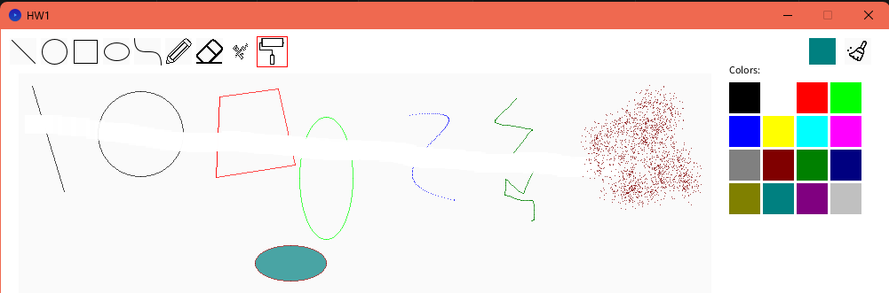

# 電腦圖學作業一報告

## 一、完成的任務

* 直線（Line）
* 圓形（Circle）

* 橢圓（Ellipse）
* 多邊形（Polygon）

* 貝茲曲線（Bézier Curve）
* 鉛筆（Pencil / 自由繪製）

* 橡皮擦（Eraser）
* 噴槍（Spray）

* 填充（Fill / 漏斗）
* 調色盤（Color Palette，16 色）

以下展示圖可顯示出所有功能：

---

## 二、各功能補充說明

以下簡單說明每個主要功能的實作概念與過程中注意到的重點。

### 直線演算法（Bresenham）

這個演算法的重點是用整數誤差來追蹤理想直線與目前像素之間的偏差，根據偏差決定下一個像素要往哪個方向走。
輸入是兩個端點座標，輸出是一連串連續的像素點，讓線條看起來平滑。
由於只用整數運算，速度很快，也特別適合逐像素繪圖。
在實作時要處理各種斜率方向的情況（八個象限），還有垂直、水平線的特例，確保線段連續不中斷。

### 圓形演算法（Midpoint Circle）

圓的部分使用中點圓演算法（Midpoint Circle Algorithm）。
它利用圓的八向對稱性，只需計算一小段的像素，再映射到其他區域即可。
透過判斷式 `f(x, y) = x² + y² - r²` 的正負來決定下一步是往右或往右下，
整個過程不需要用到浮點或開方運算，效能很好。
小半徑的情況要特別注意邊界重疊或缺口，否則會影響後續的填充功能。

### 橢圓演算法（Midpoint Ellipse）

橢圓的繪製邏輯和圓形類似，不過需要分成兩個區域：一個是斜率小於 1，一個是大於 1。
這樣才能確保橢圓邊界完整、平滑。
實作時會根據橢圓中心與兩個軸長（水平與垂直半徑）進行計算。
要注意區域交界處的像素，否則容易出現小縫隙，會讓填充功能「漏色」。
因此交界條件必須特別處理，確保邊界連續。

### 曲線演算法（Cubic Bézier）

貝茲曲線使用四個控制點（起點、終點和兩個控制點）以及參數 t（從 0 到 1）來計算曲線上的點。
每個 t 對應一個像素座標，最後把這些點連起來就能畫出平滑的曲線。
這種方式能用少量控制點畫出漂亮的曲線，非常適合向量式的繪圖。
實作時要控制採樣的間隔，如果太大會變成明顯的折線，太小則計算量會變多，要在平滑度和效能之間取平衡。

### 橡皮擦功能

橡皮擦的原理是用一個矩形或圓形區域覆蓋背景色，看起來就像把畫擦掉一樣。
滑鼠拖曳時會不斷在滑鼠附近繪製背景色；使用滑鼠滾輪可以調整橡皮擦大小（範圍有限制，避免太大或太小）。
程式上要特別避免擦到 UI 區域（例如按鈕或調色盤），只讓它作用在畫布像素上。

### 噴槍（Spray）

噴槍的效果是讓滑鼠中心附近隨機產生許多顏色點，模擬真實噴漆的顆粒感。
實作上，每次點擊都會隨機生成一批像素，位置由亂數的角度和半徑計算出來。
可以調整噴灑密度和半徑，必要時也能加入透明度控制，讓效果更自然。

### 填充工具（Flood Fill）

填充工具的概念是從使用者點選的起始像素開始，將與它顏色相同的區域換成新的顏色。
我使用非遞迴版本的 Flood Fill，用佇列（Queue / BFS）方式逐步處理上下左右相鄰的像素。
這樣可以避免深層遞迴造成 Stack Overflow。
另外，邊界不連續（例如橢圓邊漏一點點）會造成填色外漏，因此要特別確保邊界繪製完整。
如果要支援抗鋸齒或透明像素，也需要設定顏色相等的容差範圍。

### 調色盤（Color Palette）

調色盤設計在畫面右側，共有 16 種顏色。
點一下就能選擇要用的顏色，並更新全域變數 `selectedColor`。
每個新繪製的形狀都會記住當下使用的顏色，因此改變調色盤後不會影響已經畫好的圖。
畫布和調色盤區域是分開處理的，避免誤點或誤畫。

---

## 關於使用 LLM 的說明

在完成這份作業的過程中，我有輔助使用 LLM（例如 ChatGPT 或 Gemini）。
主要用途包括了解演算法原理、查詢語法、以及找出除錯方向。
當遇到問題時，我會描述情況請它幫忙提供思考路徑，但實際的程式碼撰寫、修正與測試，都是由我親自完成。
